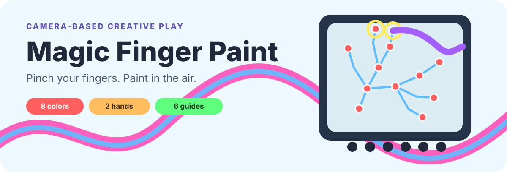

<p align="center">
  
</p>

<p align="center">
  <a href="https://ai.studio/apps/488c6e7e-e67f-49db-ba8e-d10f53e90cce"><strong>Open in Google AI Studio</strong></a>
</p>

<p align="center"><strong>English</strong> · <a href="./README.zh-CN.md">中文</a></p>

Drawing apps for kids need a screen to touch and a stylus to lose. This one needs a hand — pinch your fingers in the air and paint, through the camera you already have.

Hold up a hand, pinch thumb and index finger to paint, then open the gesture to stop. MediaPipe runs hand landmark tracking in the browser while a persistent canvas turns the pinch path into a colorful drawing.

```bash
git clone https://github.com/shenjiayi692-maker/fingerpaint && cd fingerpaint && npm i && npm run dev
```

No API key and no backend — the drawing flow runs entirely in your browser.

## One gesture, a whole canvas

- Pinch to draw and release to lift the virtual brush
- Track up to two hands independently
- Choose from eight colors and four brush sizes
- Switch to an eraser or clear the canvas
- Trace six simple guides: sun, house, heart, star, cloud, and cat
- Export the finished painting as PNG
- Use the interface in English or Chinese

The camera feed is mirrored so movement feels natural. Landmark positions are smoothed before painting, and a short pinch grace window reduces broken strokes when tracking briefly wobbles.

## Run locally

Prerequisites: Node.js and a browser with camera access.

```bash
npm install
npm run dev
```

Open the local URL, allow camera access, raise one hand into view, and pinch thumb and index finger together. No backend is required for the drawing flow.

Validate a change with:

```bash
npm run lint
npm run build
```

## How it is built

| Part | Role |
| --- | --- |
| MediaPipe Hands | Detects hand landmarks and pinch distance in the browser |
| Canvas 2D | Mirrors the camera, draws landmark feedback, and stores paint strokes |
| React + TypeScript | Coordinates camera state, tools, templates, guidance, and export |
| Motion | Handles lightweight interface transitions |
| Vite | Local development and production build |

The app requests camera permission. It does not need to upload the video stream to draw; hand inference and canvas rendering happen in the browser.

## Interaction notes

- Tracking defaults to two hands with detection and tracking confidence set to `0.7`.
- The pinch threshold is `0.04` in normalized landmark coordinates.
- Template changes ask whether to save a non-empty canvas first.
- MediaPipe assets are loaded from jsDelivr at runtime, so the first launch needs network access.

## Project status

This is an experimental creative tool. Camera quality, lighting, browser support, and device performance affect tracking. It is not designed as an accessibility input method or a substitute for professional assistive technology.
